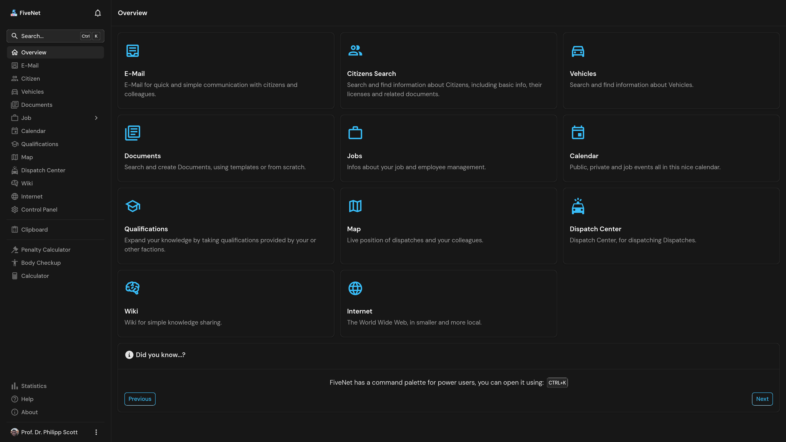

    

# FiveNet

   

     

For more screenshots and a detailed overview of the features, please check out the [FiveNet documentation](https://fivenet.app/getting-started/features).

## Table of Contents

- [Roadmap](#roadmap)
- [Features](#features)
- [Installation](#installation)
- [Translations (i18n)](#translations-i18n)
- [Security](#security)
- [Development](#development)
- [Community](#community)
- [FAQ](#faq)
- [Credits](#credits)
- [License](#license)

## Roadmap

Things on the roadmap may or may not be implemented/changed/removed without warning.
For the roadmap [click here](https://github.com/orgs/fivenet-app/projects/1/views/1).

## Features

Checkout the documentation for an uptodate list of features with screenshots [here](https://fivenet.app/user-guides).

## Installation

For detailed installation methods, please visit the [Getting Started Installation Methods](https://fivenet.app/getting-started/installation/methods) page.

### Container Images

Container images are available via [GHCR.io fivenet-app/fivenet image](https://github.com/orgs/fivenet-app/packages/container/package/fivenet).

### Helm Chart

Helm chart is available in the separate [GitHub fivenet-app/charts repository](https://github.com/fivenet-app/charts).

### Plugins

Gameserver plugins are available in the separate [GitHub fivenet-app/plugins repository](https://github.com/fivenet-app/plugins).

## Translations (i18n)

Want to help translate FiveNet or fix a translation issue? You can join the translation group by heading over to [FiveNet's POEditor.com project here](https://poeditor.com/join/project/hszo85uo3K).

Thanks to [POEditor](https://poeditor.com/) for providing FiveNet with a free translation project!

## Security

If you find a vulnerability or a potential vulnerability in FiveNet, please see the [security release process](SECURITY.md).

## Development

Please see [development documentation](https://fivenet.app/development).

## Community

Join our community on [Discord](https://discord.gg/ASRPPr8CeT) to connect with other users and developers, ask questions, and share feedback.

## FAQ

### What is FiveNet?

FiveNet is a platform designed to provide advanced tools and features for managing and enhancing your server infrastructure. For more details, visit the [FiveNet website](https://fivenet.app/).

### How do I install FiveNet?

You can find detailed installation instructions on the [Getting Started Installation Methods](https://fivenet.app/getting-started/installation/methods) page.

### Where can I get support?

You can join our [Discord community](https://discord.gg/ASRPPr8CeT) to ask questions, share feedback, and connect with other users and developers.

### How can I contribute to FiveNet?

We welcome contributions! Please refer to the [CONTRIBUTING.md](CONTRIBUTING.md) file for guidelines on how to contribute.

### Is FiveNet free to use?

Yes, FiveNet is open-source and licensed under the Apache 2.0 license. You can find more details in the [LICENSE](LICENSE) file.

## Credits

* Leaflet Livemap Code CRS: Based upon [NelsonMinar's Map Viewer Gist](https://gist.github.com/NelsonMinar/6600524) and VPC's CopNet/ MedicNet livemap code, and a lot of Leaflet CRS related Stackoverflow posts.

## License

Code licensed under Apache 2.0 license, see [LICENSE](LICENSE).

Licenses of used libraries, code and media can be found in the [`public/licenses/` folder](public/licenses/).
